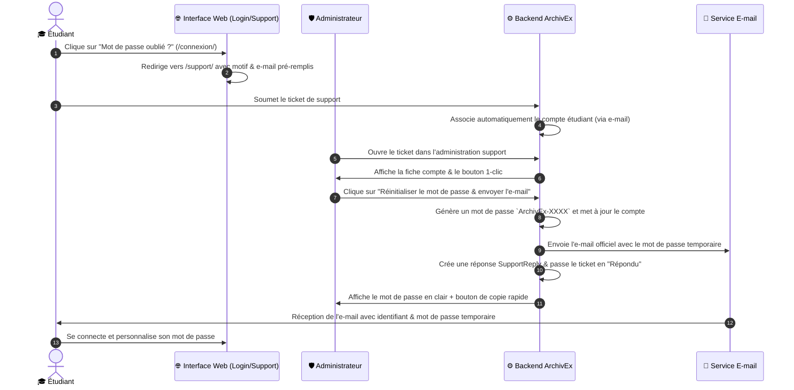

# 🔐 Guide de Réinitialisation et Récupération de Mot de Passe — ArchivEx

Ce document détaille le fonctionnement complet du système de récupération et réinitialisation de mot de passe pour les étudiants via l'espace Support d'ArchivEx.

---

## 📌 1. Vue d'ensemble

Le mécanisme permet à un étudiant bloqué ou ayant oublié son mot de passe de formuler une demande d'assistance en quelques secondes. L'administrateur peut ensuite, en **un seul clic**, réinitialiser le compte avec un mot de passe temporaire au format standardisé **`ArchivEx-XXXX`** et déclencher l'envoi d'un e-mail officiel et sécurisé contenant ses nouveaux accès.



---

## 🎓 2. Parcours de l'Étudiant

### Étape 1 : Accès depuis la page de connexion
1. L'étudiant se rend sur la page de connexion (`/connexion/`).
2. S'il a déjà saisi son adresse e-mail ou identifiant dans le champ, la valeur est conservée.
3. Il clique sur **« Mot de passe oublié ? »**.
4. Il est automatiquement redirigé vers :
   ```
   /support/nouveau/?category=recuperation_mot_de_passe&email=etudiant@exemple.com
   ```

### Étape 2 : Soumission de la demande
1. Le formulaire de support s'affiche avec la catégorie **« Récupération de mot de passe »** déjà sélectionnée.
2. L'adresse e-mail est pré-remplie.
3. L'étudiant indique son nom et précise son problème, puis clique sur **« Envoyer ma demande »**.
4. Le système détecte l'adresse e-mail et rattache automatiquement le ticket au compte utilisateur correspondant dans la base de données.

### Étape 3 : Connexion avec le mot de passe temporaire & Changement Forcé Immédiat 🔒
1. L'étudiant reçoit son e-mail officiel contenant le code temporaire `ArchivEx-XXXX`.
2. Il se connecte sur `/connexion/` avec son identifiant et ce mot de passe temporaire.
3. Le système détecte le mot de passe temporaire et le **redirige immédiatement** vers la page :
   ```
   /accounts/modifier-mot-de-passe/
   ```
4. **Bouclier de sécurité anti-contournement (`MustChangePasswordMiddleware`)** :
   - L'accès à tout le reste du site (tableau de bord, cours, épreuves, etc.) est bloqué tant que le nouveau mot de passe n'est pas choisi.
5. Une fois le nouveau mot de passe saisi et validé :
   - Le compte est définitivement sécurisé avec le mot de passe secret de l'étudiant.
   - **Le code temporaire présent dans Gmail est instantanément désactivé et inutilisable.**
   - L'étudiant est redirigé en toute sécurité vers son tableau de bord.

---

## 🛡️ 3. Parcours de l'Administrateur

### Étape 1 : Consultation du ticket
1. L'administrateur se rend sur l'espace d'administration du support (`/administration/support/`).
2. Les demandes de récupération de mot de passe apparaissent avec le badge violet distinctif **« Récupération de mot de passe »**.
3. En ouvrant le ticket, un panneau violet dédié s'affiche :
   **« 👤 Gestion du compte étudiant & Réinitialisation de mot de passe »**.

### Étape 2 : Réinitialisation en 1 clic
1. L'administrateur vérifie l'identité de l'étudiant (nom d'utilisateur, nom complet, e-mail associé, statut actif).
2. Il clique sur le bouton :
   **« Réinitialiser le mot de passe & envoyer l'e-mail »**.
3. Une confirmation navigateur lui demande de valider l'action.
4. Dès validation :
   - Le mot de passe du compte est immédiatement mis à jour avec le nouveau code temporaire.
   - L'e-mail officiel est généré et expédié à l'étudiant.
   - Un message de réponse (`SupportReply`) est consigné dans l'historique du ticket.
   - Le statut du ticket bascule automatiquement sur **« Répondu »**.

### Étape 3 : Copie rapide de secours (WhatsApp / SMS)
- Sur la page du ticket rechargée, un encadré vert de succès affiche :
  > **Mot de passe temporaire généré : `ArchivEx-XXXX`**
- Un bouton **« Copier »** permet à l'administrateur de le copier dans le presse-papier en 1 clic pour le transmettre par un canal alternatif (WhatsApp, SMS, appel) si l'étudiant n'a pas accès immédiat à sa boîte mail.

---

## ⚙️ 4. Détails Techniques & Logique Métier

### 4.1. Format du Mot de Passe Temporaire
Le mot de passe temporaire respecte scrupuleusement la nomenclature :
```text
ArchivEx-XXXX
```
- Exemple : `ArchivEx-7842`, `ArchivEx-1903`, etc.
- Généré de manière cryptographiquement sécurisée via la bibliothèque Python standard `secrets` (`secrets.randbelow(9000) + 1000`).
- Ce format est à la fois sécurisé, facile à retenir temporairement, et valorise l'image de marque de la plateforme.

### 4.2. Service E-mail (`accounts/services.py`)
Le service `send_password_reset_email` :
- Utilise Django `EmailMultiAlternatives` pour fournir à la fois une version texte brut et une version HTML responsive.
- Utilise le gabarit d'e-mail `templates/emails/password_reset_email.html` arborant la charte graphique ArchivEx (logo, bannière indigo/bleue, carte récapitulative des identifiants, bouton d'action direct vers `/connexion/`, consignes de sécurité).
- En cas d'indisponibilité momentanée du serveur SMTP, l'erreur est interceptée proprement (`fail_silently=False` dans un bloc `try/except`) : le mot de passe reste réinitialisé, l'administrateur est alerté, et il peut utiliser la copie manuelle sans blocage de l'application.

### 4.3. Modèle de Données (`support/models.py`)
- La catégorie `recuperation_mot_de_passe` a été ajoutée aux choix possibles de `SupportRequest.CATEGORY_CHOICES`.
- La migration associée est : `support/migrations/0003_alter_supportrequest_category.py`.

---

## 🧪 5. Tests Automatisés

Une suite complète de 5 tests unitaires et fonctionnels est disponible dans `support/tests.py` :
1. **`test_generate_temporary_password`** : Vérifie la structure regex `^ArchivEx-\d{4}$`.
2. **`test_send_password_reset_email`** : Vérifie la composition et l'envoi de l'e-mail multipart.
3. **`test_support_create_get_prefill`** : Vérifie la pré-sélection automatique de la catégorie et du mail.
4. **`test_support_create_links_existing_user_by_email`** : Vérifie le rattachement automatique du compte par adresse e-mail.
5. **`test_admin_reset_temporary_password_action`** : Valide l'ensemble du flux admin (mise à jour du mot de passe haché, historique support, expédition mail, statut ticket).

### Commande pour exécuter les tests :
```bash
python manage.py test support
```

---

## 🚀 6. Déploiement en Production (PythonAnywhere)

Lors de la mise en ligne sur PythonAnywhere :
1. Récupérer les modifications Git :
   ```bash
   git pull origin main
   ```
2. Appliquer la migration de base de données :
   ```bash
   python manage.py migrate support
   ```
3. Recharger l'application web via le bouton vert **« Reload »** du panneau Web PythonAnywhere.
